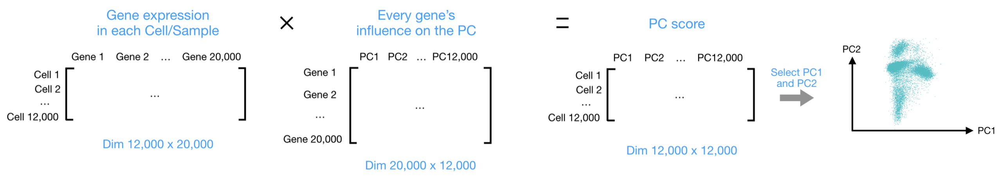

```{r,child="assets/_header-lab.Rmd"}
```

<!-- ----------------------- Do not edit above this ----------------------- -->

```{r,echo=FALSE,include=FALSE}
# CUSTOM VARIABLES

# custom ggplot theme
theme_report_h <- function (base_size=12,base_family=NULL,colour="grey60") {
  theme_bw(base_size=base_size,base_family=base_family) %+replace%
    theme(
      panel.border=element_blank(),
      panel.grid.minor=element_blank(),
      panel.grid.major.x=element_blank(),
      legend.position="top",
      legend.direction="horizontal",
      legend.justification="center",
      strip.background=element_blank(),
      axis.ticks.y=element_blank(),
      axis.ticks.x=element_line(colour=colour),
      plot.caption=element_text(hjust=0,colour=colour,size=10),
      plot.title=element_text(colour=colour),
      plot.subtitle=element_text(colour=colour)
    )
}

# custom ggplot theme
theme_report <- theme_report_v <- function (base_size=12,base_family=NULL,colour="grey60") {
  theme_bw(base_size=base_size,base_family=base_family) %+replace%
    theme(
      panel.border=element_blank(),
      panel.grid.minor=element_blank(),
      panel.grid.major.x=element_blank(),
      legend.position="right",
      legend.direction="vertical",
      legend.justification="center",
      strip.background=element_blank(),
      axis.ticks.y=element_blank(),
      axis.ticks.x=element_line(colour=colour),
      plot.caption=element_text(hjust=0,colour=colour,size=10),
      plot.title=element_text(colour=colour),
      plot.subtitle=element_text(colour=colour)
    )
}

# custom ggplot theme
theme_simple_h <- function (base_size=12,base_family=NULL,colour="grey60") {
  theme_bw(base_size=base_size,base_family=base_family) %+replace%
    theme(
      panel.border=element_blank(),
      panel.grid=element_blank(),
      legend.justification="center",
      legend.position="top",
      legend.direction="horizontal",
      strip.background=element_blank(),
      axis.ticks=element_blank(),
      axis.text=element_blank(),
      axis.title=element_blank(),
      plot.caption=element_text(hjust=0,colour=colour,size=10),
      plot.title=element_text(colour=colour),
      plot.subtitle=element_text(colour=colour)
    )
}

# custom ggplot theme
theme_simple_v <- function (base_size=12,base_family=NULL,colour="grey60") {
  theme_bw(base_size=base_size,base_family=base_family) %+replace%
    theme(
      panel.border=element_blank(),
      panel.grid=element_blank(),
      legend.justification="center",
      legend.position="right",
      legend.direction="vertical",
      strip.background=element_blank(),
      axis.ticks=element_blank(),
      axis.text=element_blank(),
      axis.title=element_blank(),
      plot.caption=element_text(hjust=0,colour=colour,size=10),
      plot.title=element_text(colour=colour),
      plot.subtitle=element_text(colour=colour)
    )
}

#colours
col_sll_green <- "#95C11E"
col_sll_blue <- "#0093BD"
col_sll_orange <- "#EF7C00"
col_sll_green_light <- "#f4f8e8"
col_sll_blue_light <- "#e5f4f8"
col_sll_orange_light <- "#fdf1e5"

```

```{r Setup, echo = FALSE}
knitr::opts_chunk$set(fig.width  = 7,
                      results    = "hold",
                      message    = FALSE,
                      cache.lazy = FALSE,
                      warning    = FALSE)
```

</br>

```{r,eval=FALSE,echo=FALSE}
# manually run this to render this document to HTML
rmarkdown::render("scRNAseq_lab2.Rmd")
```


```{r}
library(Seurat)
library(ggplot2) # plotting
library(patchwork) # combining figures
library(dplyr)
library(scater)
```


# Import data

```{r}
data.filt = readRDS("../results/data.filt.RDS")
data.filt
```


# Run SCTranform again and regress out more unwanted covariates

But first we need to identify the main unwanted variates

For this, we will run PCA first

Top PCs will catch major variation in the data

We can then build a linear model to calculate the percentage of variation that each top PC are explained by different covariates. 

```{r}
DefaultAssay(data.filt) = "SCT"

data.filt = RunPCA(data.filt, npcs = 100, verbose = F, assay = "SCT")
# Plot contribution of metadata to each PCs (variation explained by each metadata)
print("Plot contribution of metadata to each PCs...")
dummy = SingleCellExperiment::SingleCellExperiment(
  list(pc_space=t(data.filt@reductions$pca@cell.embeddings[, 1:10])), 
  colData=data.filt@meta.data[, c("nCount_RNA", "nFeature_RNA", "percent_mito", 
                                  "S.Score", "G2M.Score", "Phase")])
explan_pcs = scater::getVarianceExplained(dummy, exprs_values="pc_space")

scater::plotExplanatoryPCs(explan_pcs/100)
```

From the plot above, we can see that, all shown meta.data explain less than 1% of the variation in the top 3 PCs, we don't really need to regress them out duing `SCTransform`

but for demonstration, we can regress out S.Score, it won't hurt to do so.

Let's run `SCTransform` and regress out S.Score at the same time

```{r}
# Let's check the counts data before regressing
data.filt[["SCT"]]$counts[1:10, 1:20]

data.filt = SCTransform(data.filt, assay = "RNA", 
                        new.assay.name = "SCT", 
                        variable.features.n = 2000,
                        do.scale=F, do.center = F, 
                        return.only.var.genes = F,
                        vars.to.regress = c("S.Score"))

# Let's check the counts slot again
data.filt[["SCT"]]$counts[1:10, 1:20]
# Do they differ now?
```


# Dimensional Reduction

## PCA

Let's have a closer look at the PCA analysis

Principlal component analysis (PCA) reduces the number of dimensions in large datasets to a few number of principal componnets that retain most of the original informaton. 

PCA aims to maximize the data variation explained by the PCs. 

The first principal component is formed as a linear combination of the original variables/genes (each with a loading value) that explains the most variance. 

The second principal component explains the most variance in what is left once the effect of the first component is removed, and we may proceed through iterations until all the variance is explained.


Let's run PCA:

```{r}
data.filt = RunPCA(data.filt, npcs = 100, verbose = F, assay = "SCT")
```
It is mostly those top PCs that contain useful information, the rest of the PCs (principal components) may mostly contain random noises.

In Seurat, the tSNE and UMAP analyses below are based on the PCA result, we will only select the top significant PCs and feed them to tSNE and UMAP.

**How do we select the right number of top PCs?**

A common method for determining the number of PCs to be retained is a graphical representation known as an elbow plot. 

An **elbow plot** is a simple line segment plot that shows the data variation explained by each PC. 

  - It shows the variation explained by each PC on the y-axis and the number of PCs on the x-axis.
  - It always displays a downward curve. Most elbow plots look broadly similar in shape, starting high on the left, falling rather quickly, and then flattening out at some point. 
  - This is because the first component usually explains much of the variability, the next few components explain a moderate amount, and the latter components only explain a small fraction of the overall variability. 
  - The elbow plot criterion looks for the “elbow” in the curve and selects all components just before the line flattens out.

```{r}
ElbowPlot(data.filt, reduction = "pca", ndims = 50)
```

Here, 10 looks a good number to keep, but we usually keep a bit more than that to make sure we get most of the useful information, Let's keep 15 instead.

## tSNE

```{r}
data.filt = RunTSNE(
    data.filt,
    reduction = "pca", dims = 1:15, # Here we tell RunTSNE to use top 15 PCs
    perplexity = 30, # low perplexity: finer structure
    max_iter = 1000,
    theta = 0.5,
    eta = 200,
    num_threads = 0
)

# run ?RunTSNE to see how to adjust parameters.
```

```{r, fig.height=3, fig.width=4}
FeaturePlot(data.filt, reduction = "tsne", 
            features = "nFeature_RNA", pt.size=0.1)
# run ?DimPlot to see how to adjust parameters. 
```

What does each dot represent in the sSNE plot?

## UMAP

```{r}
data.filt = RunUMAP(
    data.filt,
    reduction = "pca",
    dims = 1:15, # Here we tell RunUMAPE to use top 15 PCs
    n.components = 2,
    n.neighbors = 30,
    n.epochs = 200,
    min.dist = 0.3,
    learning.rate = 1,
    spread = 1
)

# Run ?RunUMAP to see how to adjust the parameters
# n.neighbors: Larger values will result in more global structure being preserved at the loss of detailed local structure. 
## In general this parameter should often be in the range 5 to 50.
# min_dist: The minimum distance between two points in the UMAP embedding.
# spread: A scaling factor for distance between embedded points.
```

```{r, fig.width=4, fig.height=3}
FeaturePlot(data.filt, reduction = "umap", features = "nFeature_RNA")
```

How different is it between a tSNE plot and a UMAP plot?

Let's plot all three dimensional reduciton plots together

```{r, fig.height=3, fig.width=10}
wrap_plots(
    FeaturePlot(data.filt, reduction = "pca", features = "nFeature_RNA"),
    FeaturePlot(data.filt, reduction = "tsne", features = "nFeature_RNA"),
    FeaturePlot(data.filt, reduction = "umap", features = "nFeature_RNA"),
    ncol = 3
) + plot_layout(guides = "collect")
```

# Cell-level automatic annotation

For demonstration, here, we will only use one automatic annotation method (cell-based, reference-based), called label transfer (from Seurat). 

It needs three functions, `FindTransferAnchors()`, `TransferData()` and `AddMetaData()`. 

From the `FindTransferAnchors()` function, we will use `pcaproject`, ie the query dataset is projected onto the PCA of the reference dataset. 

Then the labels of cells in the query dataset will be decided based on the labels of its reference neighbors in the PCA space.

First, download the reference data

```{r}
reference = readRDS("../data/reference.RDS")
```

Let's process the reference data set as well, 

we will run all the steps that we did for our dataset in one go with the pipe-operator `%>%`.

```{r}
reference = reference %>%
    SCTransform() %>%
    RunPCA(verbose = F) %>%
    RunUMAP(dims = 1:15)
```

Then we do label transfer:

```{r}
transfer.anchors = FindTransferAnchors(
    reference = reference, query = data.filt,
    dims = 1:15, reduction = "pcaproject")

predictions = TransferData(
    anchorset = transfer.anchors, refdata = reference$cell_type,
    dims = 1:15
)

data.filt = AddMetaData(object = data.filt, metadata = predictions)
```

**Confidence of label transfering**

We can then examine the distribution of the prediction scores and optionally filter out those cells with low scores. 

Here, we find that most cells receive a score of 0.8 or greater.

```{r}
data.filt@meta.data$prediction.score.max %>%
  tibble::enframe() %>%
  ggplot(aes(x=value)) + 
  geom_histogram(color = "white", bins = 50) +
  geom_vline(xintercept = 0.8, linetype = 2, color = "red") + 
  theme_classic(base_size = 14) +
  ggtitle("distribution of max prediciton score")

# Let's see how many cells have prediction scores > 0.8:
table(data.filt@meta.data$prediction.score.max>0.8)

# Let's only keep cell labels that have prediction scores > 0.8:
data.filt@meta.data$predicted.id[!data.filt@meta.data$prediction.score.max>0.8] = "NA"
```


```{r, fig.height=4, fig.width=12}
# pdf("Test1.pdf", h=4, w=12)
wrap_plots(
    DimPlot(reference, reduction="umap", group.by="cell_type") + ggtitle("Reference_celltype"),
    DimPlot(data.filt, reduction="umap", group.by="predicted.id") + ggtitle("Query_predicted.id"),
    FeaturePlot(data.filt, reduction="umap", features="prediction.score.max") + ggtitle("Prediction.score"),
    ncol = 3
) + plot_layout(guides = "collect")
# dev.off()

```

- For the three figures above, the one to the left is the reference dataset, 
- the one in the middle is the predicted lables in the query dataset, 
- while the one to the right shows the confidence scores of the predicted labels in the query dataset. 

**We can now use this prediction result to help us choose the right clustering resolution**

- cMono: classical monocyte, i.e. CD14+ monocyte
- ncMono: non-classical monocyte.

For other automatic annotation methods, please see my lectures.


# Clustering

```{r}
# First we need to build a SNN Graph
data.filt = FindNeighbors(data.filt,
    reduction = "pca",
    assay = "RNA",
    k.param = 20,
    features = VariableFeatures(data.filt)
)

# SNN was built based on pca.
# run ?FindNeighbors to see how to adjust the parameters

# Clustering with few different clustering resolutions
#library(leiden)
for (res in c(0.1, 0.3, .5, 1, 1.5, 2, 2.5, 3, 3.5)) {
    data.filt = FindClusters(data.filt, graph.name = "SCT_snn", 
                             resolution = res, algorithm = 2)
}
# Algorithm for modularity optimization (
# 1 = original Louvain algorithm; 
# 2 = Louvain algorithm with multilevel refinement; 
# 3 = SLM algorithm; 
# 4 = Leiden algorithm). Leiden requires the leidenalg python.

# ?FindClusters 
```

Each time you run clustering, the data is stored in meta data columns:

```{r}
data.filt@meta.data[1:5, ]
# Can you see columns for the clustering results with different resolutions?
```

* seurat_clusters - lastest results only
* SCT_snn_res.XX - for each different resolution you test.

Plot the clustering results:

```{r, fig.height=10, fig.width=12}
# pdf("Test.pdf", h=10, w=12)
wrap_plots(
    DimPlot(data.filt, reduction = "umap", group.by = "SCT_snn_res.0.1") + 
      ggtitle("leiden_0.1"),
    DimPlot(data.filt, reduction = "umap", group.by = "SCT_snn_res.0.3") + 
      ggtitle("leiden_0.3"),
    DimPlot(data.filt, reduction = "umap", group.by = "SCT_snn_res.0.5") + 
      ggtitle("leiden_0.5"),
    DimPlot(data.filt, reduction = "umap", group.by = "SCT_snn_res.1") + 
      ggtitle("leiden_1"),
    DimPlot(data.filt, reduction = "umap", group.by = "SCT_snn_res.1.5") + 
      ggtitle("leiden_1.5"),
    DimPlot(data.filt, reduction = "umap", group.by = "SCT_snn_res.2") + 
      ggtitle("leiden_2"),
    DimPlot(data.filt, reduction = "umap", group.by = "SCT_snn_res.2.5") + 
      ggtitle("leiden_2.5"),
    DimPlot(data.filt, reduction = "umap", group.by = "SCT_snn_res.3") + 
      ggtitle("leiden_3"),
    DimPlot(data.filt, reduction = "umap", group.by = "SCT_snn_res.3.5") + 
      ggtitle("leiden_3.5"),
    ncol = 3
)
# dev.off()
```

Which clustering resolution give a result that agrees with our cell-level automatic annotation the most? 

It seems that resolution 0.3 holds the highest similarity.

Let's make a stacked barplot to check the correspondence between the predicted.id and the clustering result SCT_snn_res.0.3:

```{r, fig.height=2.5, fig.width=4}
data.filt@meta.data %>%
  ggplot(aes(x=SCT_snn_res.0.3, fill=predicted.id)) +
  geom_bar(stat="count") +
  theme_bw()
```

- Here, the x-axis shows the seven clusters generated at a resolution of 0.3, 
- the y-axis represents the number of cells each cluster has, 
- while the color of bars represents the corresponding id predicted for each cell by Seurat label transfer automatic annotation.

**The identity of most clusters are rather clear, except cluster 2,**

**for which we may need to gather more information and perform manual annotation.**

But let's first check whether cluster 2 has any quality issue (e.g. too low nFeature_RNA, nCount_RNA, too high percent_mito ...):

```{r, fig.height=3.5, fig.width=10.5}
feats = c("nFeature_RNA", "nCount_RNA", "percent_mito")
FeaturePlot(data.filt, features=feats, ncol=3)
```

The quality of cluster 2 looks ok, the nFeature_RNA is not too low and percent_mito is not too high either, nothing is obviously wrong!

Now let's do some manual annotation to gather more information:


# Manual annotation

**Marker gene table: **

|Markers|Cell Type|
|:---|:---|
|CD3E|T cells|
|CD3E CD4|CD4+ T cells|
|CD3E CD8A|CD8+ T cells|
|GNLY, NKG7|NK cells|
|MS4A1|B cells|
|CD14, LYZ, CST3, MS4A7|CD14+ Monocytes|
|FCGR3A, LYZ, CST3, MS4A7|FCGR3A+  Monocytes|
|FCER1A, CST3|DCs|

Plot the marker genes on the UMAP plot:

```{r, fig.height=9.5, fig.width=15}
# pdf("Plot3.pdf", h=9.5, w=15)
myfeatures = c("CD3E", "CD4", "CD8A", "NKG7", "GNLY", 
  "MS4A1", "CD14", "LYZ", "MS4A7", "FCGR3A", "CST3", "FCER1A")
FeaturePlot(data.filt, reduction = "umap", dims = 1:2, 
            features = myfeatures, ncol = 4, order = T) +
            NoLegend() + NoAxes() + NoGrid()
# dev.off()
```

The marker gene expression distribution agree more or less with the cell-level automatic annotation, 

But not that helpful when it comes to annotate cluster 2!

Maybe we can do manual annotation from a different angle: explore the differential gene list for each cluster and see what more information we can get there.


# Differential gene analysis

But first let's check the average non-zero count as ind the differentila gene analysis [benchmarking paper](https://doi.org/10.1038/s41467-023-37126-3):

```{r}
counts = data.filt[["RNA"]]$counts
mean(colSums(counts)/(colSums(counts>0)))
# 3.248485
```

Here, we got an average non-zero count of 3.248485, very low, 

for this low seq. depth, the Wilcoxon rank-sum test is often enough to identify differentially expressed genes for each cluster.

Wilcoxon rank-sum is a non-parametrical differential analysis method, safer to use, but may be less sensitive

Before proceed, let's first check cell number per cluster:

```{r}
table(data.filt$SCT_snn_res.0.3)
```

We run `FindAllMarkers` to look for differential genes by testing one cluster vs the rest

```{r}
Idents(data.filt) = data.filt$SCT_snn_res.0.3
markers_genes = FindAllMarkers(
    data.filt,
    log2FC.threshold = 0.2, # Limit testing to genes which show, on average, at least X-fold difference (log-scale) between the two groups of cells.
    test.use = "wilcox", # Nonparametric
    min.pct = 0.1, # Only test genes that are detected in a minimum fraction of min.pct cells in either of the two populations.
    min.diff.pct = 0.2, # Only test genes that show a minimum difference in the fraction of detection between the two groups. 
    only.pos = TRUE,
    max.cells.per.ident = 30, # Downsample each cell type to a maximum of 30 cells
    assay = "SCT",
    min.cells.group = 1 # Minimum number of cells in one of the groups
)

# Run ?FindAllMarkers to adjust for parameters!

# Filter the marker genes to only keep the significant ones (p_val_adj<0.1)
markers_genes2 = markers_genes %>% filter(p_val_adj<0.1)

# Check the acquired number of marker genes per cell type:
table(markers_genes2$cluster)
```


Plot the top marker genes: 

```{r, fig.height=4, fig.width=18}
markers_genes %>%
    group_by(cluster) %>%
    filter(p_val_adj<0.1) %>%
    slice_min(avg_log2FC, n = 10, with_ties = FALSE) -> top_sub

# pdf("Markers.pdf", h=4, w=18)
DotPlot(data.filt, features = rev(as.character(unique(top_sub$gene))), 
        group.by = "SCT_snn_res.0.3", assay = "SCT") + #coord_flip() +
        theme(axis.text.x = 
               element_text(angle = 30, vjust = 1, hjust=1))
# dev.off()

```

- In the dotplot above, dot size represents the percentage of cells expressing the genes, 
- while color represents the average expression level of one gene in the cluster.


**We can see the most specifc marker gene for clusters 2 is TRDC, which is a gamma-delta T cell marker, maybe cluster represents gamma-delta T cell**

**What do you think?**

Be aware that what are doing here is also considered **manual annotation**: 


Let's rename the clusters

```{r}
Idents(data.filt) = data.filt$SCT_snn_res.0.3
data.filt = RenameIdents(data.filt, 
                        "0" = "CD8_Tcells", 
                        "1" = "Bcells", 
                        "2" = "gamma-deltaTcells", 
                        "3" = "cMono", 
                        "4" = "CD4_Tcells", 
                        "5" = "NKcells", 
                        "6" = "ncMono")
data.filt$Annotation = Idents(data.filt)
```

Let's check the new cluster labels:

```{r, fig.height=4, fig.width=5.5}
# pdf("Annotation.pdf", h=4, w=5.5)
DimPlot(data.filt, group.by = "Annotation")
# dev.off()
```


# Save data for future exploration

```{r}
saveRDS(data.filt, "../results/data.analyzed.RDS")
```


# Recap

* Regress out unwanted variation
* Dimensional reduction: PCA, tSNE, UMAP
* Cell-level automated annotation
* Clustering 
* Manual annotation
* Differential gene analysis

# Save R package version again

```{r}
sessionInfo()
```

